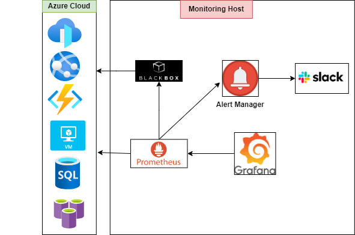
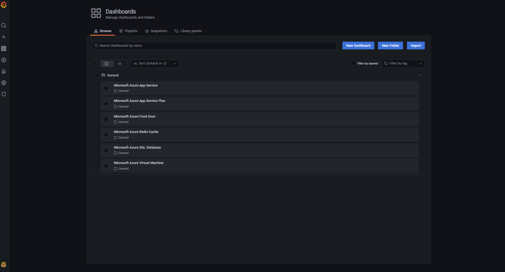

# Monitoring Architecture



In above architecture diagram, there are two parts:
- `Application Host(s)` - This virtual machine has running dockerized application along with node-explorer (to expose system metrics), promtail (to ship/expose logs metrics) and cadvisor (to expose container metrics). The application along with virtual machine host has to be monitored by monitoring host.
- `Monitoring Host`  - This virtual machine has monitoring prometheus server installed which gets metrics from application host(s) exposed by node-explorer, promtail and cadvistor etc and sends alerts to alertmanager based on prometheus rules.

Note: Monitoring tools can be installed in same application host machine, however, if you have many application host machines, it better to have a dedicated machine for monitoring all hosts.

## Overview
This tool automatically generates deployment package required for monitoring host which includes configuration related to prometheus, blackbox, node-explorer, windows-exporer, cadvisor, loki and grafana.

### Services for Application Host(s)

Please make sure below services are running on application host. (*The configuration and deployment of services related to application host is not covered in this document, however a docker-compose file can be used to install below services in application host machine*)

* Application
  * outputs log to file or console
  * exposes at port 5000 (port can be anything)

### Services for monitoring host

* prometheus
  * metrics server
  * 9090/metrics
* blackbox exporter
  * network monitoring agent
  * it can monitor several protcols like tcp, ping, http, and so on
  * 9115/metrics
* Alertmanager
  * send notification to somewhere like slack, mail, pagerduty and so on
  * 9093/metrics
* Grafana
  * viewer server
  * it can send query to prometheus, loki, and so on
  * 3000/metrics
* Azure
  * Get all metrics for specific resource(s) using `Azure Monitor Api`
  * 9276/metrics  

### Generate monitoring host deployment package automatically

To generate the package automatically, please follow below steps:

- Go to `templates/.env` file and fill it with required information related to monitoring host itself and information related to all the application hosts.
- Run the bash script `./scripts/generate_skeleton.sh`
- The package will be generated at folder `_package/monitoring`. (Please refer sample package)
- Now, you can copy `monitoring` folder to remote monitoring host machine.
- The next step is to install `monitoring/host/resource-monitoring.service`
```
	cp monitoring/host/resource-monitoring.service /etc/systemd/system/resource-monitoring.service
	systemctl enable resource-monitoring.service
```
- OR you can run docker compose directly
```
	cd monitoring/docker
	docker-compose up -d
```
- Once all docker containers are running, please validate below urls:
```bash
	#prometheus
	curl -k http://localhost:9090/metrics
	#alertmanager
	curl -k http://localhost:9093/metrics
	#blackbox exporter
	curl -k http://localhost:9115/metrics
	#grafana
	curl -k http://localhost:3000/metrics
	#azure
	curl -k http://localhost:9276/metrics
```

### Regarding Azure monitoring

If you have enabled azure monitoring for your deployment, then please follow below steps:
- Create application in `Azure Active Directory` -> `App registration`
- Then, for the newly created app, go to `Certificates & Secret` and add `New client secret` 
	- Expiration date can be given 2 years (max value)
	- Don't forget to **copy the client secret value**
- One its done, we need to add this application to subscription or resource group for the services to be monitored.
	- Go to subscription or resource group for which Azure monitoring has to be enabled
	- Go to `Access control (IAM)` -> `Role assignments` -> `Add` -> `Add role assignment` -> Select role -> `Monitoring Reader`
	- Go to `Next` -> `Select members` -> Add the application which we have just created in above steps.
- The next step is to fill below details in `templates/.env` file:
  - `TENANT_ID`: Can be found under `Azure Active Directory` -> `App registration` -> `<Your application>`
  - `SUBSCRIPTION_ID` : Can be found under properties in the Azure portal for your application/service.
  - `CLIENT_ID`: Can be found under `Azure Active Directory` -> `App registration` -> `<Your application>`
  - `CLIENT_SECRET`: This is client secret value which we copied in one of the above steps.
- The last step is create `Log Analytics workspaces` under the subscription. (To avoid alert warning while opening `Azure` dashboard in Grafana)

For more details, please refer below links:
- Regarding `azure.yml`, you can find more details [here](https://github.com/RobustPerception/azure_metrics_exporter#azure-metrics-exporter).
- Regarding `datasource.yml`, you can find more details in grafana documentation [here](https://grafana.com/docs/grafana/latest/administration/provisioning/).

### View grafana dashboards

- Go to `http://<monitoring-host-ip-address>:3000` (eg: http://localhost:3000)
- Username is `admin` and password is `password`
- In left panel, go to `Dashboards` -> `Manage`
- It will show you all the available dashboards
- You can mark the dashboard as favorite

### View logs in loki

- Go to `http://<monitoring-ip-address>:3000` (eg: http://localhost:3000)
- In left panel, go to `Explore` icon
- Select `Loki` from dropdown list
- Click on `Log browser`
- Select the labels (you can filter based on label selection)
- Run query

**Grana Dashboards**



